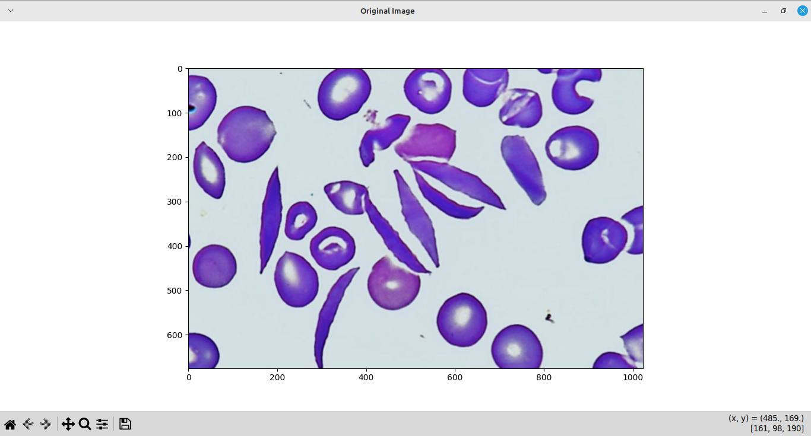
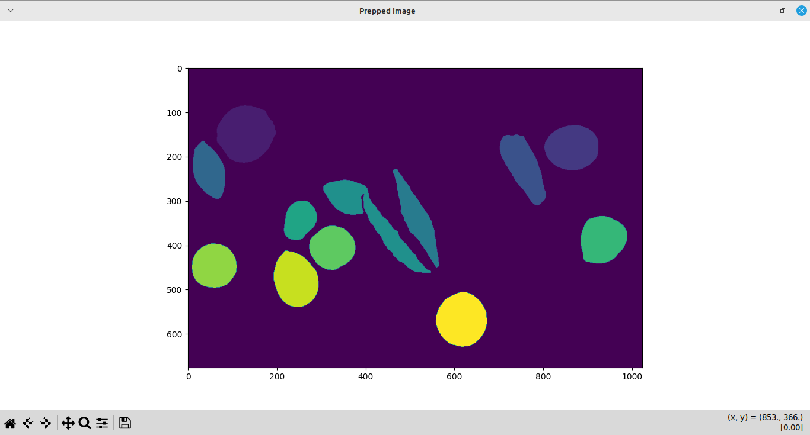
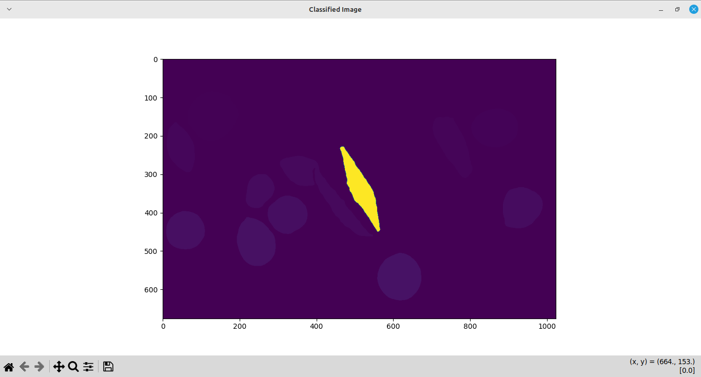
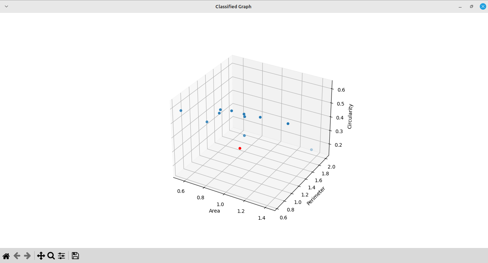

# **Sickle Cell Anemia Detection System**

## **Overview**

This project provides a **computer vision-based solution** for detecting and classifying red blood cells from microscopic images. The goal is to identify **sickle cells** among healthy red blood cells, offering diagnostic insights into **Sickle Cell Disease (SCD)**. The system utilizes feature extraction, classification, and visualization to quantify the number and type of cells.

---

## **Features**

- **Image Analysis:** Automatically analyzes a provided image of blood cells.
- **Cell Classification:** Differentiates between healthy cells and sickle-shaped cells.
- **Percentage Calculation:** Computes and displays the percentage of sickle and healthy cells.
- **Visualization:** Generates multiple visualizations to provide deeper insights into the analyzed data.

---

## **How It Works**

The system is executed with the following command:

```bash
python3 src/main.py /path/to/image/sickle4.jpg
```

This command triggers a series of operations, including image processing, classification, and visualization. The system outputs four key visualizations in separate dialog boxes.

---

## **Generated Visualizations**

Here is a breakdown of the **four visual outputs** generated when you run the code:

### 1. **Original Image**


- **Description:** This is the unprocessed input image of red blood cells as captured from the microscope.
- **Purpose:** Provides a baseline to visually inspect the raw state of the cells before further processing.
- **Inference:** From this image, you can manually identify the cells that appear sickle-shaped and compare them with the automated results.

---

### 2. **Preprocessed Image**


- **Description:** This image shows the result of the preprocessing stage, where individual cells are segmented and labeled with different colors.
- **Purpose:** Helps ensure that the segmentation process is working correctly by visually separating individual cells.
- **Inference:** Cells are isolated based on their boundaries, allowing the feature extraction algorithm to calculate shape parameters like area, perimeter, and circularity.

---

### 3. **Classified Image**


- **Description:** This image highlights only the **classified sickle cell(s)** in bright yellow, distinguishing them from other cells.
- **Purpose:** Provides a focused view of detected sickle cells to verify the classification accuracy.
- **Inference:** This helps the user visually confirm that the correct cells are flagged as sickle-shaped.

---

### 4. **3D Scatter Plot (Classified Graph)**


- **Axes:**
  - **X-Axis:** Area of the cell
  - **Y-Axis:** Perimeter of the cell
  - **Z-Axis:** Circularity of the cell

- **Description:** This scatter plot shows the distribution of individual cells based on key geometric properties (area, perimeter, and circularity). Sickle cells are highlighted in **red**.
- **Purpose:** Offers deeper insights into the dataset by visualizing how cells cluster based on their shape properties.
- **Inference:** 
  - **Blue points**: Healthy red blood cells with circular shapes.
  - **Red points**: Sickle-shaped cells detected by the algorithm.
  - This visualization helps assess the feature space used for classification.

---

## **How to Interpret the Results**

After running the command, the following outputs are printed on the terminal along with the visualizations:

```
Total Cells: 12
Sickle Cells: 1
Healthy Cells: 11
Percent Sickle: 8.33%
Percent Healthy: 91.67%
```

- **Total Cells:** The total number of cells detected in the image.
- **Sickle Cells:** The number of cells identified as sickle-shaped.
- **Healthy Cells:** The number of cells identified as normal.
- **Percent Sickle:** Percentage of sickle cells out of the total.
- **Percent Healthy:** Percentage of healthy cells out of the total.

### **Inference from Results:**

- **High percentage of sickle cells:** Indicates the presence of Sickle Cell Disease.
- **Low percentage of sickle cells:** Suggests a healthy sample, or a mild occurrence of sickle cells.
- **3D Graph interpretation:** The outliers in red (sickle cells) show distinctive differences in circularity and shape, explaining why they are flagged as abnormal.

---

## **How It Works Internally**

1. **Preprocessing:** The input image is preprocessed by converting it to grayscale and applying filters to isolate individual cells.
2. **Feature Extraction:** Key properties such as **area**, **perimeter**, and **circularity** are computed for each cell.
3. **Classification:** A machine learning classifier uses the extracted features to distinguish between healthy and sickle cells.
4. **Visualization:** Four images are generated to assist in verifying the analysis.


## **Code explanation**

## **1. main.py**

This is the **entry point** of the application.

### **Logic Flow:**
1. **Image Loading and Preprocessing:**
   - Calls `image_prep()` from `FeatureExtraction.py` to load and preprocess the input image.
   - This function converts the image to grayscale and applies segmentation to detect individual cells.

2. **Feature Extraction:**
   - After segmentation, the `findperimeter()` function is called to compute the **perimeter** for each detected cell.
   - Calculates other properties such as **area** and **circularity** from the segmented cells.

3. **Cell Classification:**
   - Uses the `KNNClassifier()` function from `Classify.py` to classify cells as either **healthy or sickle** based on extracted features (area, perimeter, and circularity).

4. **Visualization and Output:**
   - Plots four different figures:
     - Original image (as a reference)
     - Preprocessed image (segmented with different colors for each cell)
     - Highlighted classified sickle cells (colored yellow)
     - 3D scatter plot with area, perimeter, and circularity on the axes
   - Outputs statistics about the total cells, sickle cells, and healthy cells, along with their percentages.

---

## **2. FeatureExtraction.py**

This module is responsible for **preprocessing** the image and extracting features like **area, perimeter**, and **circularity**.

### **Functions:**
- **`image_prep(path)`**:
  - Loads the image from the provided path.
  - Converts the image to grayscale.
  - Applies **Canny edge detection** to identify the boundaries of cells.
  - Fills holes in the segmented objects to properly label individual cells.

- **`numofneighbour(mat, i, j, searchValue)`**:
  - A helper function to count the **number of neighboring pixels** with a given value.
  - Used during segmentation to help identify the extent of each cell.

- **`findperimeter(mat, num_features)`**:
  - Computes the **perimeter** of each labeled cell.
  - Iterates over the matrix to calculate how many boundary pixels each cell has.

---

## **3. Classify.py**

This file handles the **classification logic** using a **K-Nearest Neighbors (KNN)** approach.

### **Functions:**
- **`KNNClassifier()`**:
  - Takes in a dataset containing features (area, perimeter, circularity) and corresponding labels (1 for sickle, 0 for healthy).
  - Uses the **KNN algorithm** to classify the input cells based on their features.
  - The number of neighbors used in KNN can be fine-tuned (default is usually 3-5 neighbors).

### **How It Works:**
1. For every cell detected in the input image, the function **extracts area, perimeter, and circularity**.
2. The KNN classifier compares these features with the preloaded dataset of healthy and sickle cells.
3. It assigns the label based on the closest neighbors.

---

## **4. LabelledData.py**

This module **stores labeled data** for training the KNN classifier.

### **Functionality:**
- Contains **datasets** of features from both sickle and healthy cells.
- These datasets are used to **train the KNN classifier** when the code runs.
- The labeled data helps the classifier identify which cells are healthy or sickle by comparing feature similarities.

---

## **5. Tools.py**

Contains **utility functions** that assist with data normalization and manipulation.

### **Functions:**
- **`convert_to_relative(value, max_value)`**:
  - Normalizes a given feature value (like area or perimeter) by dividing it by the **maximum value**.
  - Ensures that features are scaled properly to prevent any bias during classification.

- **Other Helper Functions:**
  - May include functions for calculating distances, managing datasets, or manipulating images before passing them to the classifiers.

---

## **How the Code Works Together:**

1. **Image Input:**  
   - The `main.py` script accepts an image path, loads it using `image_prep()` from `FeatureExtraction.py`.

2. **Segmentation and Feature Extraction:**  
   - The image is converted to grayscale, and cells are segmented.  
   - Features like **area, perimeter**, and **circularity** are computed for each segmented cell.

3. **Classification:**  
   - The extracted features are passed to `KNNClassifier()` in `Classify.py` for classification.
   - The classifier labels cells as **sickle (1)** or **healthy (0)**.

4. **Visualization:**  
   - Four visualizations are generated to display the results:
     1. Original Image
     2. Preprocessed Image
     3. Highlighted sickle cells
     4. 3D scatter plot showing cell distributions based on features.

5. **Result Output:**  
   - The results are printed to the terminal, showing the total number of cells, sickle cells, healthy cells, and their respective percentages.